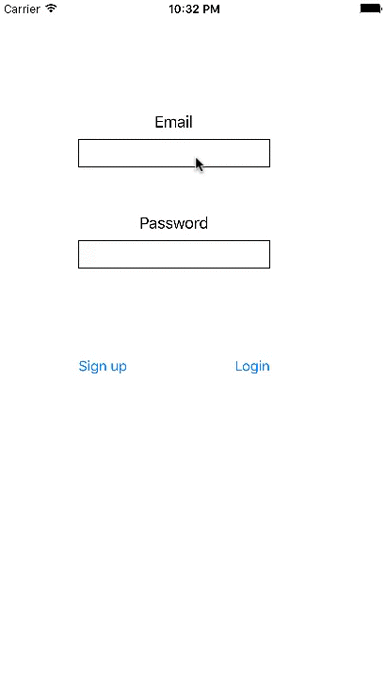

# Parse Chat

Parse Chat is a chat client app communite through a sharing Parse Developer Account [Parse API](https://parseplatform.github.io).

Time spent: 2 hours spent in total

## User Stories

The following **required** functionality is completed:

- [X] Milestone 1: Setup
  * [X] Create a new project
  * [X] Add the Parse pod
  * [X] Enable Swift support
  * [X] Using a sharing Parse Developer Account

- [X] Milestone 2: Create a Login Screen
  * [X] Create LoginViewController
  * [X] Add the following views to the login screen:
    * [X] An email TextField and a password TextField
    * [X] A login button
    * [X] A sign up button
  * [X] Allow a new user to sign up or login 

- [X] Milestone 3: Send a Chat Message
  * [X] Create ChatViewController for chat room
  * [X] After a successful sign up or login from, modally present the ChatViewController
  * [X] At the top of the layout, add a text field and a button to compose a new Message
  * [X] When the user taps the button, create a new message in Parse

- [X] Milestone 4: View the Chat Room
  * [X] Display the messages in a TableView
  * [X] Pull down all the messages from Parse

- [X] Milestone 5: Associating Users with Messages
  * [X] When creating a new message, add a key called user and set it to the current user.
  * [X] Modify the custom message cell to display the username (if it exists).
  * [X] When querying for messages, instruct Parse to fetch the related user.

## Video Walkthrough 

Here's a walkthrough of implemented user stories:

Walkthrough recorded by QuickTime Player.

## Notes

- It require the first pull down to show all the message from parse.

## License

    Copyright 2017 Chi Hon Law

    Licensed under the Apache License, Version 2.0 (the "License");
    you may not use this file except in compliance with the License.
    You may obtain a copy of the License at

        http://www.apache.org/licenses/LICENSE-2.0

    Unless required by applicable law or agreed to in writing, software
    distributed under the License is distributed on an "AS IS" BASIS,
    WITHOUT WARRANTIES OR CONDITIONS OF ANY KIND, either express or implied.
    See the License for the specific language governing permissions and
    limitations under the License.4001011013303120.1

